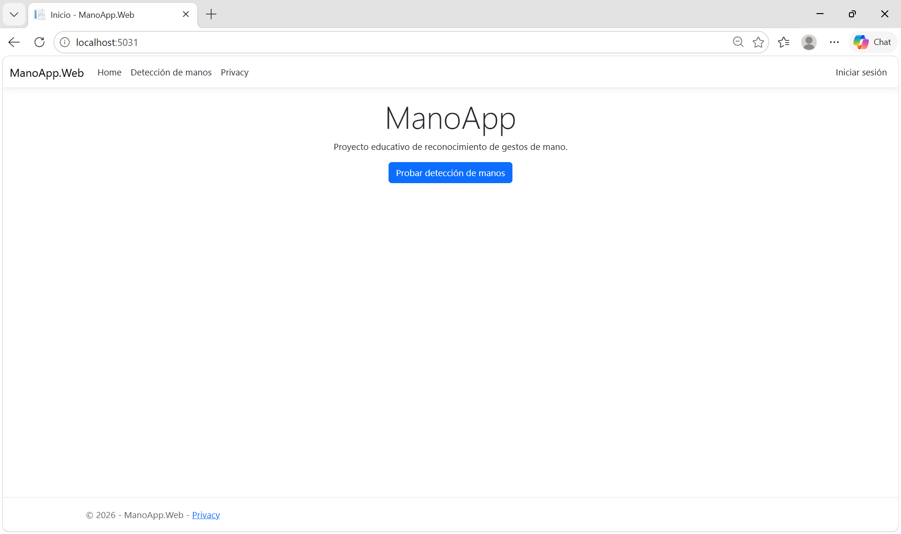
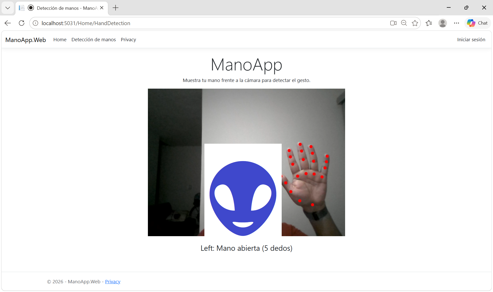
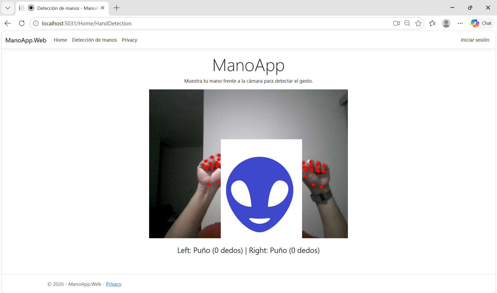
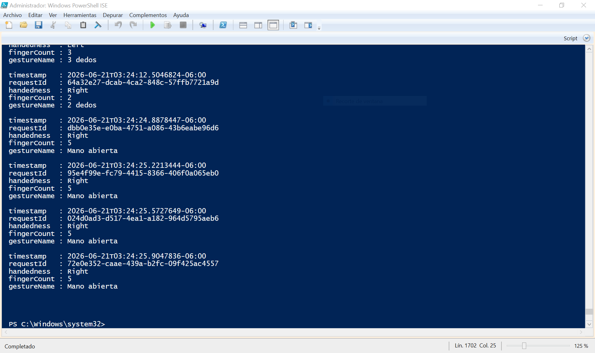
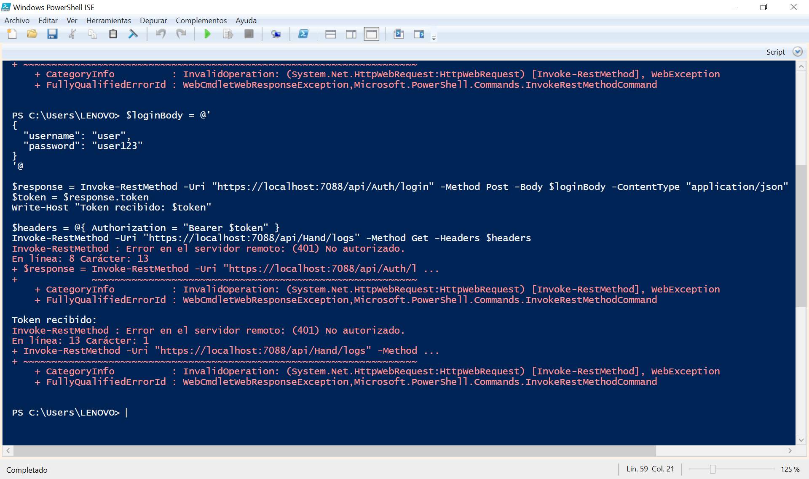

# ManoApp

Aplicación web educativa que reconoce gestos de la mano a través de la cámara del navegador. Detecta cuántos dedos se muestran y clasifica algunos gestos básicos (puño, pulgar arriba, paz, mano abierta).

Este proyecto es una demo didáctica: la misma aplicación evoluciona a través de distintos estilos y patrones de arquitectura de software, manteniendo siempre el mismo comportamiento visible para el usuario. Cada etapa vive en su propia rama de Git, para poder comparar el "antes y después" de cada decisión arquitectónica.

## Cómo funciona

- La detección de la mano y sus 21 puntos de referencia (landmarks) la hace **MediaPipe Hands**, corriendo en JavaScript dentro del navegador.
- El navegador envía esos landmarks al backend en **ASP.NET Core**, que interpreta los puntos: cuenta cuántos dedos están extendidos y clasifica el gesto.
- El resultado se muestra de vuelta en la página.

## Cómo correrlo

1. Clona el repositorio.
2. Abre `ManoApp.Web/ManoApp.Web.sln` en Visual Studio.
3. Ejecuta el proyecto (F5 o el botón de Debug).
4. La aplicación corre por default en `http://localhost:5031`.

## Roadmap de arquitectura

| Rama | Etapa | Descripción |
|---|---|---|
| `01-mvc` | MVC | Punto de partida. Toda la lógica de negocio vive dentro del Controller, sin separación de responsabilidades. |
| `02-hexagonal` | Arquitectura Hexagonal | El núcleo de negocio (clasificación de gestos) se aísla detrás de Ports, con el Controller como Adapter de entrada. |
| `03-csv-persistence` | Persistencia + Control de acceso | Se agrega un Adapter de salida que guarda un historial de lecturas en CSV, y autenticación/autorización simple para que solo un rol Admin pueda consultarlo. |
| `04-api` | API REST | ManoApp.Api se convierte en la única puerta de entrada a los datos, con DTOs propios, Swagger, y autenticación JWT (migrada desde cookies en Web). |
| `05-gof-patterns` | Patrones GOF | Se aplican patrones de diseño (Strategy para clasificación de gestos, Observer/Factory para el registro de eventos). |
| `06-12factor-cloud-ready` | 12-Factor / Nube | Configuración por variables de entorno, logging estructurado, Dockerfile, listo para desplegar. |

## Documentación de decisiones

Las decisiones de arquitectura de este proyecto están documentadas como ADRs (Architecture Decision Records) en [`docs/adr`](./docs/adr).

## Estado actual

🟢 Rama `04-api`

## Screenshots

### Pantalla de inicio de ManoApp 

Mostrando el navbar con las secciones disponibles (Home, Detección de manos, Privacy) y la opción de Iniciar sesión, junto con el botón principal para acceder a la demo de reconocimiento de gestos.

---

### Detección en tiempo real — Mano abierta

Vista de detección de manos mostrando los 21 landmarks dibujados sobre la cámara en vivo, clasificando correctamente el gesto como "Mano abierta" con 5 dedos extendidos.

---

### Detección en tiempo real — Dos manos, Puño

Detección simultánea de ambas manos mostrando el gesto "Puño" (0 dedos extendidos) para cada una, confirmando que el sistema clasifica correctamente múltiples manos en un mismo frame.

---

### Historial de gestos vía PowerShell — Acceso autorizado

Consulta del endpoint protegido `/api/Hand/logs` usando un token JWT válido con rol Admin, mostrando el historial de gestos detectados (timestamp, requestId, mano, conteo y nombre del gesto).

---

### Prueba de autorización — Acceso denegado

Intento de iniciar sesión y consultar el historial de logs con un usuario sin permisos suficientes, confirmando que la API rechaza correctamente la petición con `error 401` No autorizado.

---

## Uso de IA

Declaro que el uso de IA en este proyecto solo se limita a cuestiones estéticas (front), tests y debuggeos. La idea es original, así como su diseño arquitectónico e implementación.

## Autor

Dr. Jorge J. Pedrozo Romero — proyecto de referencia para la materia de Arquitectura de Software.