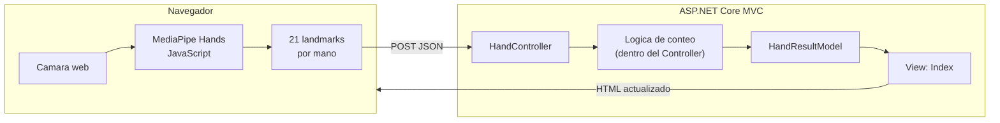

# ADR-01: Arquitectura inicial en MVC para ManoApp

| Campo  | Valor |
|--------|-------|
| Autor  | Jorge Pedrozo |
| Fecha  | 17/06/2026 |
| Estado | `Aceptado` |

---

## Contexto

ManoApp es una aplicación web que reconoce gestos de la mano a través de la cámara del navegador: detecta cuántos dedos está mostrando el usuario y clasifica algunos gestos estáticos básicos (puño cerrado, palma abierta, pulgar arriba, entre otros). Está pensada como una demo educativa — un proyecto de referencia que recorre distintos estilos arquitectónicos sobre el mismo caso de uso, para que se pueda ver "antes y después" de cada decisión.

La detección de la mano en sí (encontrar dónde está la mano y sus puntos de referencia en la imagen) la hace una librería externa que corre en el navegador (MediaPipe Hands). Eso significa que el backend en .NET no recibe video ni imágenes — recibe coordenadas de puntos ya calculados (21 puntos por mano), y su trabajo es interpretarlos: contar dedos extendidos y clasificar el gesto.

En esta primera etapa el objetivo es tener lo más simple posible funcionando de punta a punta: que el navegador capture la cámara, envíe los puntos al servidor, y el servidor regrese un resultado que se vea en pantalla. No hay todavía necesidad de pensar en separar el negocio de la infraestructura, ni en persistencia, ni en una API formal — eso viene en etapas posteriores. Lo que sí importa desde ahora es dejar un punto de partida ordenado y con buenas prácticas básicas, porque esta misma base se va a ir transformando rama por rama.

Como restricción de tiempo, tengo alrededor de dos semanas para construir todo el recorrido (de MVC hasta un MVP listo para nube), así que cada etapa tiene que ser rápida de construir sin sacrificar que se entienda bien.

---

## Decisión

Voy a construir esta primera versión usando **ASP.NET Core con el patrón MVC** (Model-View-Controller), usando un Controller que recibe los landmarks por una petición HTTP simple (POST), un Model que representa esos landmarks y el resultado del conteo, y una View que muestra el video de la cámara junto con el resultado.

### ¿Por qué?

Elegí MVC para esta primera etapa por tres razones concretas:

1. **Es el patrón más simple que cubre el flujo completo.** Necesito algo que reciba una entrada (los landmarks), la procese, y la muestre — MVC me da justo esas tres piezas sin que tenga que inventar capas adicionales todavía.
2. **Es intencionalmente la versión "sin arquitectura" del proyecto.** Esta rama va a servir después como punto de comparación: en la siguiente etapa voy a migrar a Arquitectura Hexagonal, y quiero que se note el contraste — aquí el Controller va a tener la lógica de negocio (contar dedos) directamente adentro, sin abstracciones, a propósito.
3. **ASP.NET Core MVC sirve vistas con HTML/JS nativamente**, lo cual necesito porque ahí vive el código de MediaPipe que captura la cámara y dibuja los landmarks — no tengo que montar un proyecto de frontend separado solo para esta etapa.

### Alternativas consideradas

| Alternativa | Por qué la descarté |
|-------------|---------------------|
| Empezar directo con Arquitectura Hexagonal | Para un proyecto que apenas tiene una sola regla de negocio (contar dedos), separar en puertos y adaptadores desde el día uno no se siente como una necesidad real, sino como complejidad innecesaria. Quiero que la migración a Hexagonal se sienta justificada cuando llegue, no forzada desde el inicio. |
| Hacerlo como un proyecto de consola (sin web) | Hubiera sido más rápido de armar, pero no puedo capturar la cámara del usuario ni mostrar resultados en tiempo real sin un navegador de por medio — la cámara web solo es accesible fácilmente desde JavaScript en un `<video>`. |
| Usar Web API pura desde el inicio (sin Views) | Lo descarté para esta etapa porque todavía necesito servir el HTML con el `<video>` y el `<canvas>` donde corre MediaPipe. Separar la API del frontend tiene sentido más adelante (etapa 4 de mi plan), pero aquí solo me complica tener dos proyectos corriendo cuando con uno basta. |

---

## Consecuencias

**✅ Lo que gano:**

- **Técnica:** tengo el flujo completo (cámara → servidor → resultado en pantalla) funcionando rápido, con muy poca configuración, lo cual me deja tiempo para las etapas que sí son el punto central del proyecto (Hexagonal, persistencia, patrones GOF).
- **De proceso:** al dejar la lógica de negocio mezclada con el Controller a propósito, tengo un "antes" claro y honesto para comparar contra el "después" de la siguiente rama — no estoy simulando código desordenado, es el desorden natural de no haber tomado todavía una decisión de separación de responsabilidades.

**⚠️ Lo que sacrifico o asumo:**

- **Limitación técnica:** el Controller en esta etapa va a violar el principio de Responsabilidad Única — al mismo tiempo recibe la petición HTTP, interpreta los landmarks y decide el resultado. Si este proyecto creciera sin refactor, cualquier cambio en la lógica de conteo obligaría a tocar el mismo archivo que maneja HTTP, lo cual es justo el problema que SOLID busca evitar.
- **Deuda o riesgo:** no hay ninguna prueba unitaria todavía, porque la lógica de negocio no está aislada — para probarla tendría que simular una petición HTTP completa. Esto es deuda intencional: se resuelve en la siguiente etapa, cuando el núcleo de negocio se separe detrás de una interfaz y se pueda probar de forma aislada.

## Diagrama

En esta etapa todo el procesamiento de negocio vive dentro de `HandController` — no hay una capa de Servicio ni de Dominio separada. Esa es la decisión consciente de esta rama (`01-mvc`): mostrar el punto de partida antes de cualquier refactor arquitectónico.
