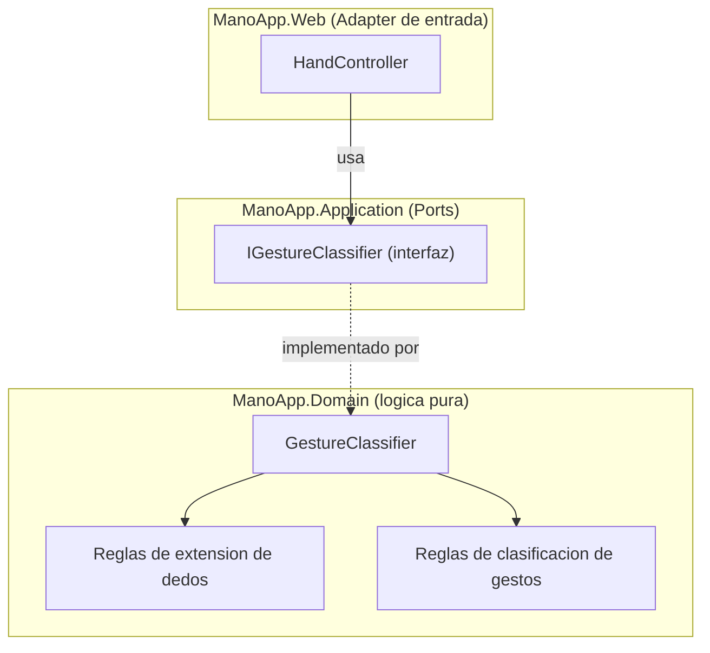

# ADR-02: Migración a Arquitectura Hexagonal

| Campo  | Valor |
|--------|-------|
| Autor  | Jorge Pedrozo |
| Fecha  | 20/06/2026 |
| Estado | `Aceptado` |

---

## Contexto

En la rama `01-mvc` (documentada en ADR-01) construí la primera versión funcional de ManoApp: una vista captura la cámara, MediaPipe detecta la mano y manda los landmarks al backend, y `HandController` calcula cuántos dedos están extendidos y clasifica el gesto (Puño, Pulgar arriba, Paz, Mano abierta, o un conteo genérico).

Esa primera versión cumplió su objetivo — tener el flujo completo funcionando rápido — pero, tal como anticipé en el ADR-01, dejó una deuda intencional: toda la lógica de negocio (la geometría para decidir qué dedos están extendidos, y las reglas para nombrar el gesto) vive directamente dentro de `HandController`, mezclada con la responsabilidad de manejar la petición HTTP. Hoy ese Controller hace dos trabajos distintos al mismo tiempo: recibir/responder HTTP, y decidir negocio.

El problema concreto que esto ya me está causando: no puedo escribir una prueba unitaria de "si recibo estos landmarks, ¿el gesto correcto es Mano abierta?" sin simular una petición HTTP completa. Y si en una etapa futura quiero agregar persistencia (CSV, en la rama 03) o más patrones de diseño (rama 05), cada una de esas cosas tendría que entrar también al mismo Controller, empeorando el problema.

## Decisión

Voy a reestructurar el proyecto siguiendo **Arquitectura Hexagonal** (Ports and Adapters), organizada en **proyectos `.csproj` separados** dentro de la misma solución:

- **`ManoApp.Domain`** — las entidades y la lógica de negocio pura: la clasificación de gestos y el conteo de dedos. Este proyecto no va a tener ninguna referencia a ASP.NET Core ni a ningún paquete de infraestructura.
- **`ManoApp.Application`** — los Ports (interfaces) que definen lo que el dominio necesita o expone. Aquí vive `IGestureClassifier`, la interfaz que expone la operación de clasificar una mano detectada y obtener un resultado.
- **`ManoApp.Web`** — pasa a ser el Adapter de entrada principal: contiene `HandController` (reducido a un traductor delgado de HTTP a dominio) y, más adelante, los demás Adapters de salida.

### ¿Por qué?

1. **El Controller deja de tener dos responsabilidades.** Después de la migración, `HandController` solo va a recibir el JSON, llamarle al `IGestureClassifier` inyectado, y regresar el resultado como HTTP — nada de geometría ni reglas de gestos va a vivir ahí.
2. **El dominio se vuelve probable de forma aislada.** Con la lógica detrás de una interfaz, puedo escribir pruebas unitarias de xUnit que llamen directamente al clasificador con landmarks de prueba, sin necesitar un servidor HTTP corriendo. Esto es justo lo que planeo hacer desde esta misma rama.
3. **Deja la puerta abierta para las siguientes etapas sin retrabajo.** Cuando en la rama 03 agregue persistencia en CSV, o en la rama 05 aplique Strategy para los gestos, esos cambios van a vivir en nuevos proyectos Adapter o dentro de `ManoApp.Domain`, sin tocar el Controller ni romper nada que ya funcione — es exactamente la promesa de Hexagonal: los detalles externos pueden cambiar sin que el núcleo se entere.
4. **Consistencia con lo que ya enseñé.** En la práctica de Hexagonal que ya impartí a mis alumnos, la separación se hizo con proyectos `.csproj` independientes, no con carpetas dentro de un mismo proyecto. Usar la misma estructura aquí evita enseñar dos variantes distintas del mismo patrón, y hace que el ejemplo de ManoApp sea directamente reconocible para quien ya vio esa práctica.

### Alternativas consideradas

| Alternativa | Por qué la descarté |
|-------------|---------------------|
| Quedarme en MVC tal cual, solo mover la lógica a una clase `GestureService` sin interfaz | Resuelve parcialmente el problema de responsabilidad única, pero sin una interfaz (Port) de por medio, el Controller seguiría acoplado directamente a una implementación concreta — no podría sustituirla fácilmente en pruebas ni en etapas futuras. Es un paso a medias que no me prepara para lo que viene. |
| Organizar las capas como carpetas dentro del mismo proyecto `ManoApp.Web`, sin proyectos separados | La consideré primero por velocidad: menos fricción de configuración, sin múltiples `.csproj` que mantener. La descarté porque la separación entre dominio e infraestructura quedaría solo como convención, no forzada por el compilador — y porque ya tengo el precedente de enseñar la versión con proyectos separados a mis alumnos; usar una variante distinta aquí generaría inconsistencia innecesaria entre lo que enseño y lo que muestro como ejemplo de referencia. |
| Aplicar Clean Architecture completa (con capas adicionales como Use Cases explícitos) | Es un paso más allá de lo que necesito ahora — mi lógica de negocio es relativamente simple (clasificar un gesto), no justifica una capa de Use Cases separada de Application todavía. Prefiero introducir esa complejidad solo si el proyecto la llega a necesitar. |

---

## Consecuencias

**✅ Lo que gano:**

- **Técnica:** el núcleo de clasificación de gestos queda aislado y puede probarse con xUnit sin levantar un servidor — voy a poder escribir pruebas que llamen directo a `IGestureClassifier` con landmarks fijos y verificar el resultado esperado.
- **De proceso:** las siguientes ramas (persistencia, API, patrones GOF) van a poder construirse como Adapters nuevos, sin volver a tocar ni romper el Controller ni el dominio ya probado — cada etapa se vuelve un *agregado*, no un *refactor* del trabajo anterior.

**⚠️ Lo que sacrifico o asumo:**

- **Limitación técnica:** múltiples proyectos significan más configuración (cada uno con su propio `.csproj`, referencias de proyecto entre ellos) y tiempos de compilación ligeramente mayores que tener todo en un solo proyecto. También tengo que ser cuidadoso con la dirección de las referencias: `ManoApp.Web` puede referenciar a `ManoApp.Application` y `ManoApp.Domain`, pero nunca al revés — si alguna vez agrego una referencia en sentido equivocado, rompo el principio de inversión de dependencias que le da sentido a toda esta separación.
- **Deuda o riesgo:** estoy introduciendo más proyectos y archivos para una lógica de negocio que, en términos de líneas de código, sigue siendo relativamente pequeña (un clasificador de 4-5 gestos). El beneficio real de esta inversión se va a notar en las ramas 03 a 06, no en esta misma — por ahora, una parte de la complejidad agregada es una apuesta a futuro, no una necesidad inmediata.

## Diagrama

En esta etapa, `HandController` (en el proyecto `ManoApp.Web`) ya no conoce la geometría ni las reglas de gestos — solo conoce la interfaz `IGestureClassifier`, definida en el proyecto `ManoApp.Application`. La implementación real (`GestureClassifier`, dentro de `ManoApp.Domain`) es la que sabe cómo resolver el problema, y es la pieza que voy a poder probar de forma aislada con xUnit, sin que ese proyecto de pruebas necesite saber nada de ASP.NET Core.