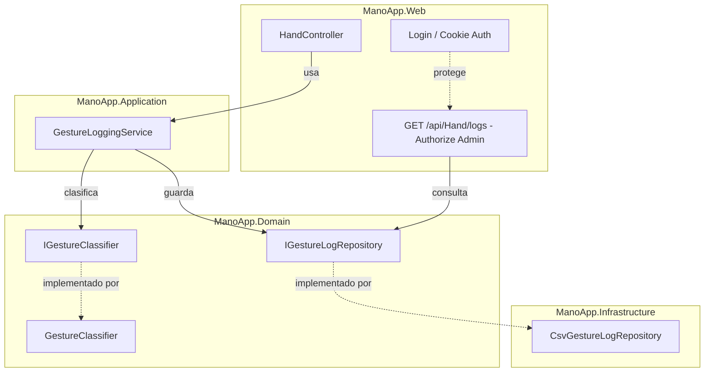

# ADR-03: Persistencia de historial en CSV y control de acceso simple

| Campo  | Valor |
|--------|-------|
| Autor  | Jorge Pedrozo |
| Fecha  | 20/06/2026 |
| Estado | `Reemplazado por ADR-04` |

---

## Contexto

En la rama `02-hexagonal` (ADR-02) separé el núcleo de negocio (`GestureClassifier`) del resto de la aplicación, dejándolo aislado detrás de un Port (`IGestureClassifier`) y probado con xUnit. El roadmap original de este proyecto, documentado en el README, planeaba que la siguiente etapa (`03-csv-persistence`) agregara únicamente un historial de lecturas guardado en CSV, dejando la puerta abierta para auditoría futura.

Sin embargo, mientras preparaba esta etapa, surgió un cambio de contexto real que decidí incorporar en lugar de ignorar: en el curso del que ManoApp es material de apoyo, mis alumnos ya cursaron la unidad de APIs y varios de ellos quieren ahora incorporar control de acceso (roles de administrador vs. usuario) a sus propios proyectos, modificando su diseño arquitectónico original a medio desarrollo. Esto es exactamente el tipo de situación que ocurre en proyectos reales — un requerimiento nuevo aparece después de que la arquitectura inicial ya está definida — y decidí que ManoApp debía modelar también ese escenario, en lugar de limitarse a un roadmap predecible y cerrado.

Por esta razón, el alcance de esta rama crece más allá de lo anunciado originalmente: además de la persistencia en CSV, voy a agregar autenticación y autorización simples, de modo que un usuario con rol Admin pueda consultar el historial de gestos detectados, mientras que un usuario normal no tenga acceso a esa información.

Una restricción importante de tiempo y de coherencia con el curso: mis alumnos todavía no han visto Entity Framework Core ni bases de datos relacionales — eso llega hasta la Unidad III, dentro de aproximadamente dos semanas. Por lo tanto, decidí no usar ASP.NET Core Identity completo (que típicamente requiere EF Core y una base de datos relacional para las tablas de usuarios y roles) en esta etapa, para no adelantar una tecnología que mis alumnos aún no conocen y que podría generar más confusión que claridad si la ven aquí antes de tiempo.

## Decisión

Esta rama incorpora dos piezas:

### 1. Persistencia del historial de gestos en CSV

- Agrego un nuevo Port en `ManoApp.Domain`: `IGestureLogRepository`, con un método `Save` (para registrar un resultado) y `GetAll` (para que la capa de autorización pueda exponerlos después).
- Creo un nuevo proyecto `ManoApp.Infrastructure`, donde vive la implementación concreta `CsvGestureLogRepository`, que escribe cada resultado como una fila en un archivo CSV con las columnas: `Timestamp`, `RequestId`, `Handedness`, `FingerCount`, `GestureName`. El archivo rota por día (`gestures-log-yyyy-MM-dd.csv`), guardado en `ManoApp.Web/App_Data/logs/`.
- El `RequestId` es un identificador único generado una sola vez por cada petición HTTP recibida, y se repite en todas las filas que provengan de esa misma petición (cuando se detectan varias manos en un mismo frame), para poder agruparlas después en un análisis.
- Agrego en `ManoApp.Application` un servicio de orquestación que coordina ambos Ports: primero le pide a `IGestureClassifier` que clasifique las manos recibidas, y después le pide a `IGestureLogRepository` que guarde cada resultado. `HandController` deja de llamar directamente a `IGestureClassifier` y pasa a llamar a este servicio de orquestación — es el primer uso real de la capa `Application`, que hasta ahora existía vacía.

### 2. Autenticación y autorización simples

- Implemento autenticación basada en cookies (Cookie Authentication de ASP.NET Core), sin Entity Framework ni base de datos.
- Los usuarios de prueba (con su contraseña y rol) se definen en `appsettings.json`, no hardcodeados directamente en una clase, para poder cambiarlos sin recompilar.
- Defino únicamente dos roles: `Admin` y `Usuario` — el mínimo necesario para resolver el caso de uso real (separar quién puede ver el historial y quién no).
- Agrego un endpoint protegido (`GET /api/Hand/logs` o similar) decorado con `[Authorize(Roles = "Admin")]`, que expone el historial de gestos a través de `IGestureLogRepository.GetAll()`. Cualquier usuario sin ese rol, o sin sesión iniciada, recibe un rechazo de autorización.

### ¿Por qué?

1. **La persistencia cumple la promesa original del proyecto**, dejando un historial auditable sin romper nada de lo construido en `01-mvc` ni en `02-hexagonal` — el `HandController` sigue sin saber nada de CSV ni de archivos, solo conoce el servicio de orquestación.
2. **El control de acceso resuelve un caso real**, no inventado: mis propios alumnos están viviendo este escenario en sus proyectos, y ManoApp puede servir de referencia exactamente para esa situación — cómo adaptar una arquitectura existente cuando llega un requerimiento que no estaba en el plan original.
3. **Evito ASP.NET Core Identity y EF Core deliberadamente en este punto**, porque introducirlos ahora significaría enseñar, a través de este proyecto de referencia, una tecnología que mis alumnos todavía no han visto formalmente en el curso. Prefiero que ManoApp avance en sincronía con lo que ellos ya conocen, y dejar Identity completo para una etapa posterior, cuando lleguen a la Unidad III.
4. **El Port `IGestureLogRepository` queda diseñado pensando en el futuro**, aunque hoy solo tenga una implementación en CSV — el día que se introduzca una base de datos relacional, bastará con escribir un nuevo Adapter (`SqlGestureLogRepository` o similar) que implemente la misma interfaz, sin tocar el dominio ni el servicio de orquestación.

### Alternativas consideradas

| Alternativa | Por qué la descarté |
|-------------|---------------------|
| Mantener el alcance original del roadmap (solo CSV, sin auth) y posponer todo el tema de control de acceso a una rama futura | La consideré seriamente por mantener cada rama enfocada en una sola idea, como hasta ahora. La descarté porque el valor pedagógico de mostrar una arquitectura adaptándose a un requerimiento no planeado, justo cuando mis alumnos están viviendo lo mismo, es mayor que mantener el roadmap impecable. |
| Implementar ASP.NET Core Identity completo con EF Core desde ahora, como adelanto de la Unidad III | La descarté por desincronización con el curso: presentar una tecnología no vista formalmente podría generar más confusión que claridad, y además introduce una dependencia (base de datos relacional) que no es necesaria para resolver el problema real de "admin sí, usuario no". |
| Usar autenticación basada en JWT en lugar de cookies | Es una opción válida, especialmente pensando en que más adelante (rama `04-api`) habrá una API más formal que podría ser consumida por clientes distintos al navegador. La descarté por ahora porque cookies es más simple de implementar y de explicar cuando el único cliente real sigue siendo la misma vista MVC con JavaScript — puedo reconsiderar JWT si la rama 04 lo amerita. |

---

## Consecuencias

**✅ Lo que gano:**

- **Técnica:** el dominio queda con dos Ports limpios y bien definidos (`IGestureClassifier`, `IGestureLogRepository`), y `ManoApp.Application` por fin tiene una responsabilidad real de orquestación, en lugar de quedar como un proyecto vacío esperando trabajo.
- **De proceso:** ManoApp ahora puede usarse como ejemplo concreto frente a mis alumnos para discutir cómo adaptar una arquitectura existente cuando llega un requerimiento nuevo a medio camino — que es justo lo que varios de ellos están viviendo con sus propios proyectos.

**⚠️ Lo que sacrifico o asumo:**

- **Limitación técnica:** la autenticación basada en `appsettings.json` con contraseñas en texto plano **no es segura para un entorno real** — es aceptable únicamente porque ManoApp es una demo educativa sin usuarios ni datos reales. Si este proyecto algún día se desplegara con datos sensibles, este mecanismo tendría que sustituirse antes de cualquier uso productivo.
- **Deuda o riesgo:** estoy posponiendo deliberadamente la migración a ASP.NET Core Identity con EF Core, lo cual significa que en una etapa futura voy a tener que reemplazar el mecanismo de autenticación completo, no solo extenderlo — login, manejo de sesión y validación de credenciales van a cambiar de fondo. Es una decisión consciente de sincronización con el curso, no una limitación técnica del diseño actual.

## Diagrama

`HandController` ya no conoce ni la clasificación ni la persistencia directamente — todo pasa por `GestureLoggingService`, en `ManoApp.Application`, que es quien coordina ambos Ports del dominio. El Adapter de CSV vive en `ManoApp.Infrastructure`, completamente aislado: si se reemplaza por una base de datos en el futuro, ni el dominio ni el servicio de orquestación necesitan cambiar.
