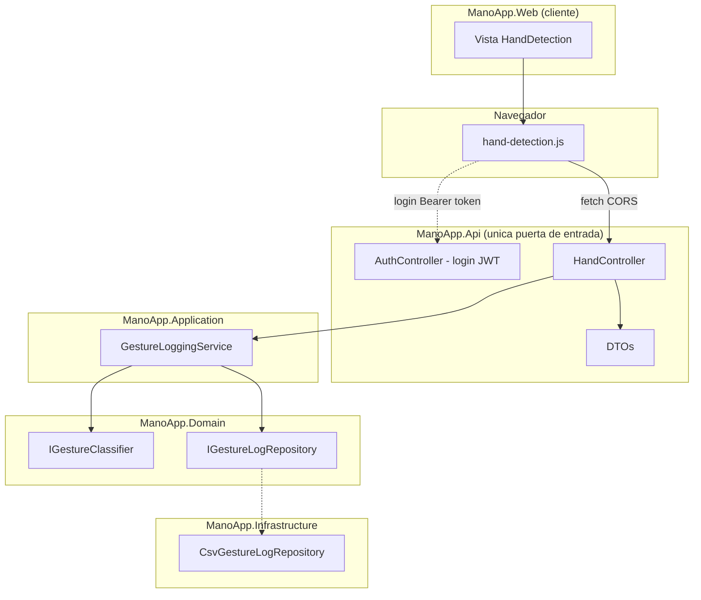

# ADR-04: API REST separada con DTOs, Swagger y autenticación JWT

| Campo  | Valor |
|--------|-------|
| Autor  | Jorge Pedrozo |
| Fecha  | 21/06/2026 |
| Estado | `Aceptado` |

---

## Contexto

Hasta la rama `03-csv-persistence`, todos los datos de ManoApp (clasificación de gestos, historial, autenticación) se servían desde `ManoApp.Web`, el mismo proyecto que también renderiza la vista con la cámara. El roadmap original de este proyecto planeaba, para esta etapa, separar una Web API formal con DTOs propios, documentada con Swagger — pensada como demostración de que cualquier cliente nuevo (otra vista web, una app móvil, un servicio de mensajería) debería poder conectarse a un único punto de verdad para los datos, sin depender de que `ManoApp.Web` también esté corriendo.

Al diseñar esta etapa surgió una decisión importante: si de verdad quería demostrar ese principio, no bastaba con tener una API "de exhibición" además del endpoint que ya funcionaba en `ManoApp.Web` — eso hubiera significado mantener dos copias de la misma lógica, justo el antipatrón que se quiere evitar. Decidí que `ManoApp.Api` debía convertirse en la única puerta de entrada real a los datos, y que `ManoApp.Web` debía consumirla como cualquier otro cliente.

## Decisión

Esta rama incorpora las siguientes piezas:

### 1. Proyecto `ManoApp.Api` como única puerta de entrada a los datos

- Creé un nuevo proyecto ejecutable `ManoApp.Api` (plantilla ASP.NET Core Web API), con referencias a `ManoApp.Domain`, `ManoApp.Application` y `ManoApp.Infrastructure`.
- Moví el endpoint `POST /api/Hand` desde `ManoApp.Web` hacia `ManoApp.Api`, y **eliminé** `HandController` de `ManoApp.Web` por completo — ya no existe duplicación.
- `ManoApp.Web` ahora consume `ManoApp.Api` vía `fetch()` desde JavaScript, configurando CORS en `ManoApp.Api` para permitir explícitamente el origen de `ManoApp.Web`.
- Configuré Visual Studio para iniciar ambos proyectos simultáneamente (múltiples proyectos de inicio), de modo que la demo siga siendo "un solo F5", a pesar de tratarse de dos procesos distintos.

### 2. DTOs propios para el contrato de la API

- Creé `DetectedHandDto`, `HandLandmarkDto` y `GestureResultDto` dentro de `ManoApp.Api`, como espejo de los modelos de dominio (`DetectedHand`, `HandLandmark`, `GestureResult`).
- El mapeo entre DTOs y modelos de dominio se hace manualmente, dentro del propio `HandController`, sin librerías de mapeo automático — una decisión deliberada para que el código siga siendo explícito y fácil de explicar paso a paso.
- Aunque hoy los DTOs son prácticamente idénticos a sus contrapartes de dominio, son conceptualmente independientes: el contrato público de la API ya no cambia automáticamente si el dominio cambia internamente.

### 3. Documentación automática con Swagger

- Integré Swashbuckle.AspNetCore para generar documentación OpenAPI/Swagger UI a partir de los Controllers y DTOs existentes, sin anotaciones manuales adicionales.

### 4. Migración completa de autenticación a JWT, dentro de `ManoApp.Api`

- Dado que `ManoApp.Api` se convirtió en la única puerta de entrada a los datos, decidí que también debía ser responsable de proteger su propio acceso — moví toda la autenticación que antes vivía en `ManoApp.Web` (cookies) hacia `ManoApp.Api`, esta vez usando JWT en lugar de cookies.
- Elegí JWT sobre cookies porque es el mecanismo más adecuado cuando una API puede ser consumida por clientes de cualquier tipo (navegador, móvil, otro servicio) y no solo por un navegador en el mismo origen o uno de confianza vía CORS.
- Repliqué el mismo patrón simple de la rama 03 (usuarios y roles desde `appsettings.json`, sin Entity Framework ni base de datos), ahora generando un token firmado en `POST /api/Auth/login` en lugar de una cookie.
- El endpoint `GET /api/Hand/logs` quedó protegido con `[Authorize(Roles = "Admin")]`, validado correctamente: un usuario sin token recibe `401`, un usuario autenticado sin el rol correcto recibe `403`, y un Admin autenticado recibe el historial completo.

### ¿Por qué?

1. **Cumple la promesa real de tener una API**: cualquier cliente futuro (otra vista, una app móvil, un servicio externo) puede conectarse a `ManoApp.Api` sin necesitar que `ManoApp.Web` exista o esté corriendo.
2. **Evita la duplicación de lógica** que hubiera existido si solo se hubiera agregado una API de exhibición en paralelo al endpoint que ya funcionaba en `Web`.
3. **La seguridad vive donde viven los datos**: tiene sentido que `ManoApp.Api`, al ser la única fuente real de la información, sea también quien decide quién puede verla — dejar la autenticación en `Web` mientras los datos viven en `Api` hubiera sido una inconsistencia arquitectónica.
4. **JWT prepara el terreno para clientes no-navegador**: aunque hoy el único consumidor real sigue siendo `ManoApp.Web`, el mecanismo elegido ya no asume que el cliente sea necesariamente un navegador con cookies.

### Alternativas consideradas

| Alternativa | Por qué la descarté |
|-------------|---------------------|
| Mantener `/api/Hand` en `ManoApp.Web` y crear endpoints espejo en `ManoApp.Api` solo de exhibición | La descarté porque traicionaba el argumento real de tener una API: si los datos siguen siendo accesibles también desde `Web` de forma independiente, no existe un único punto de verdad, solo una copia adicional. |
| Mantener cookies en `ManoApp.Api` en lugar de migrar a JWT | Las cookies dependen de que el cliente sea un navegador con el origen correcto configurado en CORS; JWT no tiene esa limitación y es el estándar más natural para una API consumida por múltiples tipos de cliente, que es justo el escenario que esta rama buscaba habilitar. |
| Usar AutoMapper para el mapeo entre DTOs y modelos de dominio | Lo descarté por preferencia didáctica: el mapeo manual, aunque más verboso, es más fácil de seguir línea por línea para quien está aprendiendo el patrón por primera vez. Puede reconsiderarse si el número de DTOs creciera mucho. |

---

## Consecuencias

**✅ Lo que gano:**

- **Técnica:** existe un solo punto de entrada real a los datos de ManoApp, con su propio contrato (DTOs) y su propia protección (JWT), completamente independiente de cómo está construida la vista en `ManoApp.Web`.
- **De proceso:** la demo ahora puede usarse para explicar, con código real, la diferencia entre `Web` (un cliente más, sirviendo HTML) y `Api` (la fuente de verdad) — exactamente la separación que mis alumnos están buscando aplicar en sus propios proyectos.

**⚠️ Lo que sacrifico o asumo:**

- **Limitación técnica — deuda documentada de troubleshooting:** intenté configurar el botón interactivo "Authorize" de Swagger UI (para poder pegar un token JWT y probar endpoints protegidos directamente desde la interfaz), usando la sintaxis estándar de Swashbuckle (`AddSecurityDefinition` y `AddSecurityRequirement` con tipos `OpenApiSecurityScheme` y `OpenApiReference`). El código no compiló: la versión de `Microsoft.OpenApi` que arrastra `Swashbuckle.AspNetCore 10.2.2` como dependencia reorganizó sus namespaces (`Microsoft.OpenApi.Models` ya no contiene esos tipos, y viven directamente bajo `Microsoft.OpenApi`), y además el tipo `OpenApiSecurityScheme` en esa versión ya no expone una propiedad `Reference` de la forma que la documentación clásica de Swashbuckle describe — sugiriendo un cambio más profundo de API entre versiones, no solo un cambio de namespace. En lugar de perseguir la versión exacta correcta de esa sintaxis, decidí dejar `AddSwaggerGen()` en su forma simple (sin definición de seguridad) y verificar el flujo completo de JWT con `Invoke-RestMethod` de PowerShell, que confirmó que la autenticación y autorización funcionan correctamente de extremo a extremo. El botón "Authorize" de Swagger queda como mejora pendiente, no como necesidad funcional — Swagger UI sigue documentando correctamente la forma de los DTOs y los endpoints disponibles.
- **Deuda o riesgo:** ahora existen dos procesos que deben correr simultáneamente para que la demo funcione completa (`Web` y `Api`), con la complejidad adicional de CORS configurado entre ambos. Si el puerto de alguno de los dos cambia, hay que actualizar tanto la configuración de CORS en `Api` como la URL del `fetch()` en el JavaScript de `Web`.

## Diagrama

`ManoApp.Web` ya no tiene ningún Controller de datos — solo sirve la vista y el JavaScript que consume `ManoApp.Api` como cualquier otro cliente externo lo haría. Toda la seguridad y los datos viven exclusivamente del lado de `ManoApp.Api`.
